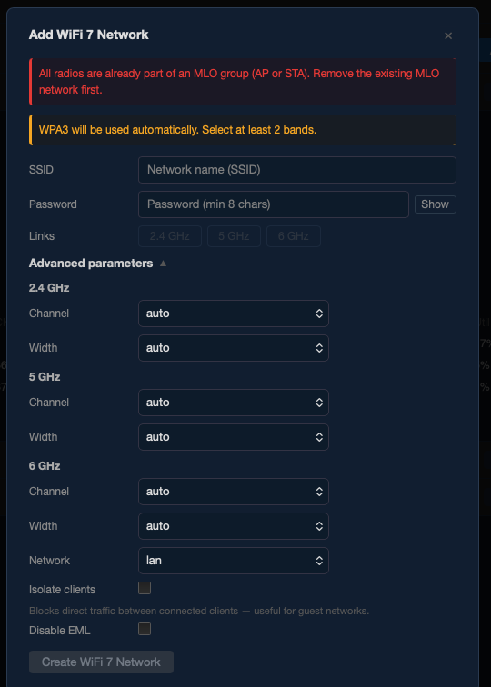
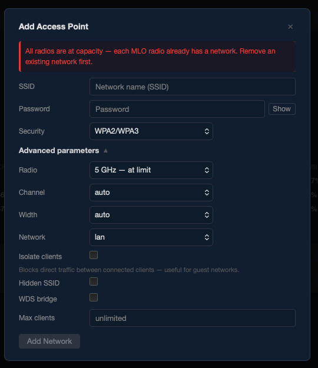
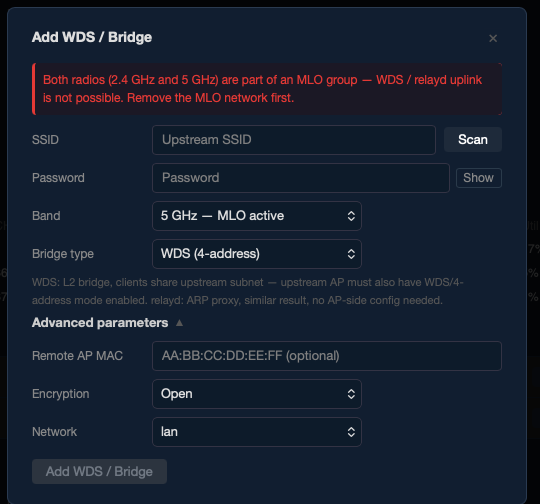
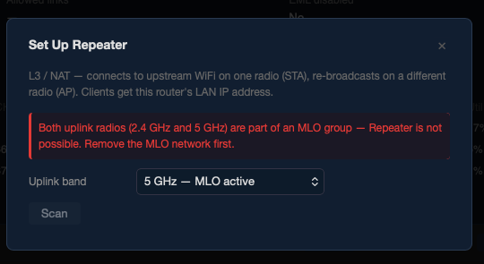

> **Note for moderators / readers:** This thread may appear to be a duplicate of the earlier v1.1.1 release thread. It is intentionally separate. Version 1.1.1 did not include any protection against adding mutually incompatible WiFi networks — doing so could silently lock the MT7996 hardware semaphore register, which survives soft reboots and requires a power-off of at least 15 minutes (to fully discharge the BPI-R4 board capacitors) to recover. Version 2.0.0 addresses this at the wizard level and warrants its own thread.

---

# luci-app-wifimgr v2.0.0 — WiFi 7 / MLO manager for BPI-R4 (MT7988A)

A LuCI-based WiFi manager for the **Banana Pi BPI-R4** (MT7988A SoC, MT7996 tri-band WiFi 7).

Designed for the current MTK SDK stack — kernel 6.12.x, MT7996 firmware, mt76 driver — with full support for **Multi-Link Operation (MLO)**, per-radio TX power management, and all supported client modes.

> **Requires an MTK SDK build** from [bpi-r4-deploy](https://github.com/woziwrt/bpi-r4-deploy). Not compatible with mainline OpenWrt — interface naming (`ap-mld-*`), MLD UCI configuration, and hostapd vendor extensions differ significantly.

---

## Hardware

| Component | Details |
|-----------|---------|
| Board | Banana Pi BPI-R4, BPI-R4 PoE |
| SoC | MediaTek MT7988A (Filogic 880) |
| WiFi chip | MT7996 tri-band (2.4 GHz / 5 GHz / 6 GHz) |
| WiFi standard | 802.11be (WiFi 7), MLO |
| RAM variants | 4 GB / 8 GB |

---

## Why this matters — the hardware semaphore problem (and why v2.0.0 fixes it)

The MT7996 chip contains an internal MCU with a hardware semaphore register. Under certain conditions — specifically, adding a second legacy AP to a radio that is already part of an MLO group using `wifi reload` — the driver triggers an EDCCA crash that locks this register.

The locked state **survives soft reboots and short power cycles** because the on-board capacitors on the BPI-R4 keep the chip powered for several seconds after shutdown.

**Symptom** — `dmesg` shows:
```
mt7996e: Failed to start patch
mt7996e: Failed to release patch semaphore
mt7996e: probe with driver mt7996e failed with error -11
```
WiFi is completely dead. The only fix is to disconnect from power for **at least 15 minutes**.

**v2.0.0 prevents this entirely.** All wizards now detect and block the configurations that trigger the crash before they are applied:

- Adding a second AP to an MLO radio → blocked with an inline error
- Adding an MLO AP when radios are already in another MLO group → blocked
- Adding an MLO STA when a local MLO AP or another MLO STA is already active → blocked
- WDS / Repeater uplink on a radio that is part of an MLO group → blocked
- Applying an AP to an MLO radio → always triggers reboot instead of `wifi reload`, even if the UI guard is somehow bypassed

---

## Installation

### Included in firmware (recommended)

`luci-app-wifimgr` is included by default in all BPI-R4 firmware images built via [bpi-r4-deploy](https://github.com/woziwrt/bpi-r4-deploy) — covering all hardware variants (standard, PoE, 4 GB, 8 GB).

No additional steps needed after flashing.

### Standalone APK

Download the latest APK from the [Releases](https://github.com/woziwrt/mt7996-wifi7-manager/releases) page and install:

```sh
# Copy APK to router
scp luci-app-wifimgr-2.0.0-r20260517.apk root@192.168.1.1:/tmp/

# Install (no internet required)
ssh root@192.168.1.1 'apk add --allow-untrusted --no-network /tmp/luci-app-wifimgr-*.apk'
```

Then open LuCI → **Network → WiFi Manager**.

### Before upgrading — back up your WiFi config

Before any sysupgrade or APK reinstall, export your wireless configuration from the **Diagnostics** tab:

**Network → WiFi Manager → Diagnostics → Wireless Backup / Restore → Download backup**

This saves your current `/etc/config/wireless` as a file. After upgrading, use the same tab to restore it — networks come back exactly as configured, without manual reconfiguration.

> UCI config normally survives an APK reinstall (`apk del` + `apk add`) without a backup. For sysupgrade, the backup is essential — the wireless config is wiped along with the rest of the overlay filesystem.

---

## Changelog

### v2.0.0 (2026-05-17)

**New features**

- **Channel advisor** — "Scan channels" button in each radio card. Scans nearby APs and survey noise, computes interference-weighted score, and recommends top 3 channels as color-coded buttons (green/yellow/red). Click to apply immediately.
- **Scan in wizards** — Station, WDS, and Repeater wizards now have a live scan button that lists nearby networks. Selecting one auto-fills SSID and encryption.
- **All-band nearby scan** — Diagnostics "Nearby Networks" now scans all three bands simultaneously.
- **Preamble puncturing** — per-radio subchannel exclusion (EHT). Visual 20 MHz bitmap — click to puncture/restore individual subchannels for DFS coexistence.
- **Version badge** — UI header shows current package version.

**Safety / crash protection**

- **EDCCA crash prevention in wizardAP** — Radios that are part of an MLO group and already have one legacy AP are disabled in the selector ("— at limit") and show a blocking error.
- **EDCCA crash prevention in wizardMLO** — Link toggle buttons for radios already in an existing MLO group are disabled.
- **MLO radio always reboots** — wizard_ap() detects if the target radio is part of an MLO group and triggers a reboot instead of `wifi reload`, eliminating the risk of EDCCA crash even if the UI guard is bypassed.
- **MLO conflict blocking in wizardStation** — MLO STA mode is blocked if a local MLO AP or another MLO STA is already active.
- **MLO conflict blocking in wizardWDS / wizardRepeater** — Radios that are part of any MLO group (AP or STA) are disabled as uplink options.

**Bug fixes**

- Fixed misleading "DFS scan in progress" message shown on 2.4G interfaces (which have no DFS).
- Fixed TX power display in Radios tab — manual mode now shows the configured UCI value instead of the driver-reported regulatory maximum.
- Fixed scan interface selection — channel advisor and uplink scan now correctly derive the phy interface from radio_id.

---

### v1.1.1 (2026-05-14)

- Sysupgrade to OpenWrt 99211b26fb (kernel 6.12.x, MTK SDK May 2026)
- First-run UCI defaults (country=CZ, renamed default SSID)
- Hotplug TX power fix for MT7996 cold-boot TMAC=0 bug on band0/band2

### v1.0.0 (2026-05-10)

- Initial public release
- All wizards: MLO AP, legacy AP, Station (incl. MLO STA), WDS, relayd, Repeater, Country
- Networks / Radios / Clients / Diagnostics tabs
- TX power modes: Regulatory / eFuse max / Manual
- Channel utilization, noise, thermal, MLO internals in Diagnostics

---

## Screenshots

| Networks | Radios |
|----------|--------|
|  |  |

| Clients | Diagnostics |
|---------|-------------|
|  |  |

**Safety blocks — wizards actively prevent incompatible configurations:**

| Station Wizard | MLO Wizard blocked | AP Wizard blocked |
|----------------|-------------------|-------------------|
|  |  |  |

| WDS / Bridge blocked | Repeater blocked |
|----------------------|-----------------|
|  |  |

---

## Features overview

### Wizards — guided network setup

| Wizard | Description |
|--------|-------------|
| **MLO AP** | Creates a Multi-Link Operation AP across 2 or 3 bands. Supports 2G+5G, 2G+6G, 5G+6G, or all three. WPA3 enforced. |
| **AP** | Creates a standard single-band AP on any radio. Full control over channel, width, encryption, SSID isolation, hidden SSID, client limits. DFS supported with CAC progress indication. |
| **Station** | Connects to an upstream WiFi network on 2.4G or 5G. MLO STA mode supported — multi-band client connecting to an upstream MLO AP. |
| **WDS / Bridge** | Wireless bridge using 4-address WDS mode or L2 relayd ARP proxy. |
| **Repeater** | Uplink STA connection on one radio + local AP on a separate radio (L3 NAT). |
| **Country** | Changes regulatory domain. Requires reboot to apply kernel regulatory database. |

### Networks tab

Live list of all configured networks with status indicators, band pills, encryption labels, and client counts. Each row expands to show the full configuration. Inline edit and remove with wifi reload.

### Radios tab

Per-radio configuration (channel, bandwidth, country) and TX power management:

| Mode | Description |
|------|-------------|
| **Regulatory** | Country SKU table applied. `sku_idx=0`, no manual txpower override. |
| **eFuse max** | Driver runs at hardware eFuse maximum. Requires reboot. |
| **Manual** | Per-radio dBm cap. `sku_idx=0` + `txpower=N`. |

Channel advisor and preamble puncturing are also accessible here.

### Clients tab

Live client list showing signal (color-coded), WiFi generation badge (WiFi 4/5/6/7), bitrate, and per-link data for MLO clients. Disconnect button.

### Diagnostics tab

Firmware version, CPU and WiFi chip temperatures, per-radio channel utilization / noise / TX stats, MLO internals (MLD address, active links, EMLSR/STR status), log download, all-band nearby scan, and wireless backup / restore.

---

## Supported network combinations

| Combination | Works | Notes |
|-------------|:-----:|-------|
| MLO AP (2 or 3 bands) | ✅ | Requires reboot |
| MLO AP + legacy AP on each MLO radio | ✅ | Max 1 extra per radio, requires reboot |
| MLO AP + STA uplink (radio0 or radio1) | ✅ | `wifi reload` OK |
| MLO AP + WDS bridge | ✅ | radio0 or radio1 |
| MLO AP + L2 relayd | ✅ | radio0 or radio1 |
| Legacy APs only (no MLO) | ✅ | Up to ~4 per radio, `wifi reload` |
| Legacy AP + STA uplink on same radio | ✅ | radio0 or radio1 only |
| Legacy AP + WDS bridge | ✅ | radio0 or radio1 |
| MLO STA (all 3 bands) | ✅ | Requires reboot |
| MLO STA + legacy APs | ✅ | No EDCCA risk — MLO STA is not an AP |
| Repeater (STA + local AP on different radio) | ✅ | |
| **MLO AP + MLO STA** | ❌ | Same 3 radios — physically impossible |
| **MLO AP + 2 or more extra APs on same radio** | ❌ | EDCCA crash — **wizard blocks this** |
| **6 GHz STA (non-MLO)** | ❌ | Driver limitation — see below |
| **Multiple MLO AP groups** | ❌ | Single chip / one wiphy |
| **Repeater with STA and AP on the same radio** | ❌ | Wizard blocks this |
| **WDS/relayd on a radio in an MLO group** | ❌ | Driver limitation — wizard blocks this |
| **Two MLO STA connections simultaneously** | ❌ | One wpa_supplicant instance per router |

---

## Known limitations

- **6G STA (non-MLO):** Not supported. MT7996 always routes band2 through the MLD code path — a standalone 6G STA scan returns no results. 6G uplink is only possible via MLO STA.
- **Per-link RSSI on secondary MLO links:** Driver reports signal only for the primary data link. Secondary links show `—`. Driver limitation, not fixable in software.
- **6G channel utilization:** Always `n/a` — driver bug: `mbssid=1` causes hostapd to report 126% utilization. Discarded in layer2.

---

## Requirements

- OpenWrt with **MediaTek SDK (MTK SDK)** — kernel 6.12.x, MT7996 firmware, mt76 driver
- Board: Banana Pi BPI-R4 or BPI-R4 PoE (MT7988A / MT7996)
- LuCI installed

Not compatible with mainline OpenWrt.

---

## Links

- **Firmware (all variants):** [bpi-r4-deploy](https://github.com/woziwrt/bpi-r4-deploy)
- **Package source + APK releases:** [mt7996-wifi7-manager](https://github.com/woziwrt/mt7996-wifi7-manager)
