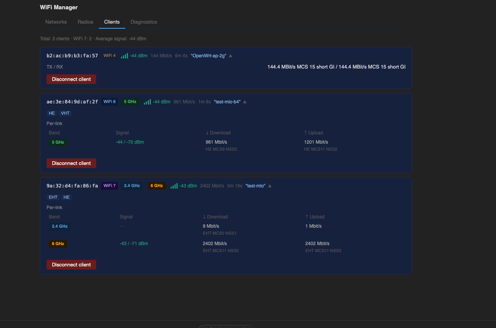
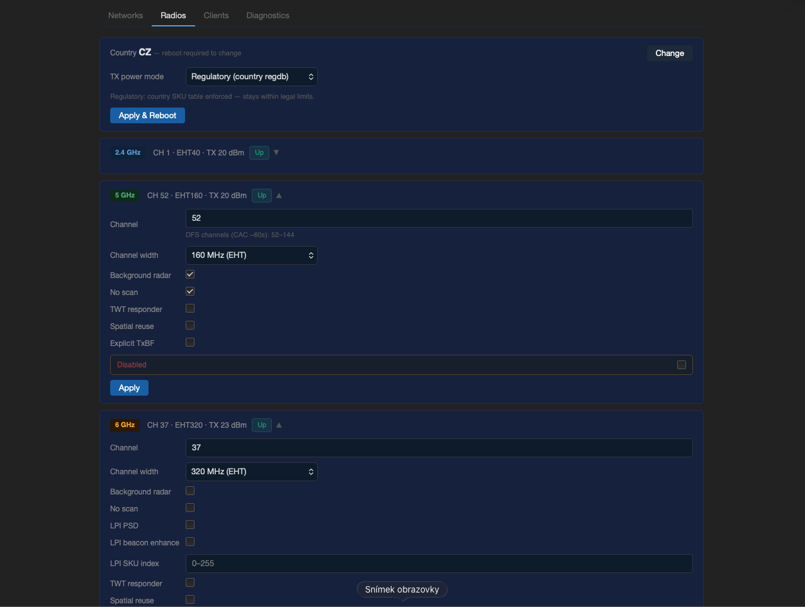
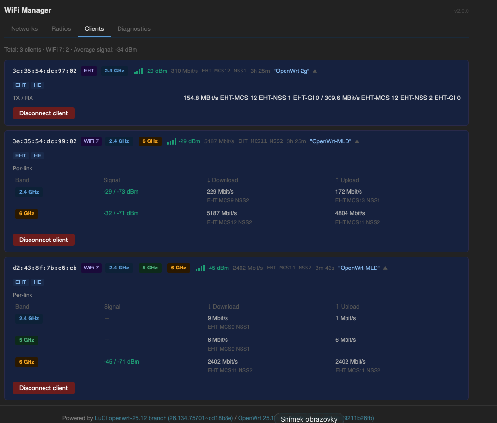
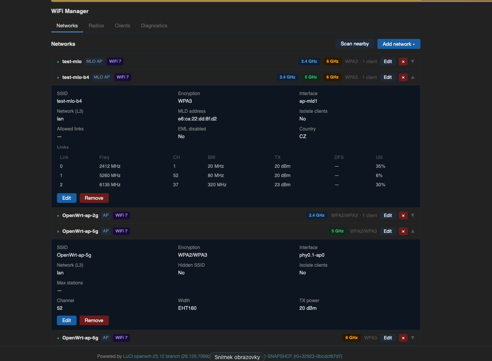
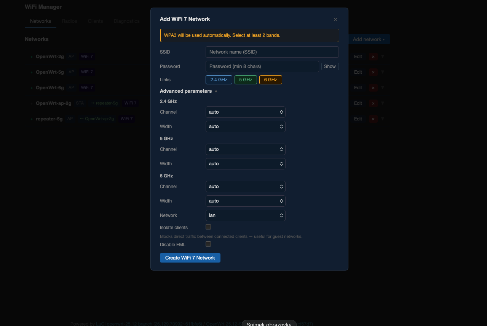
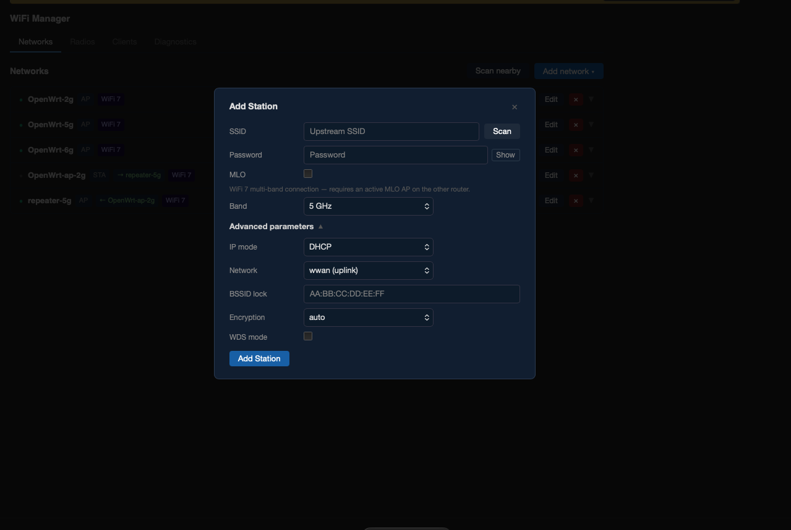
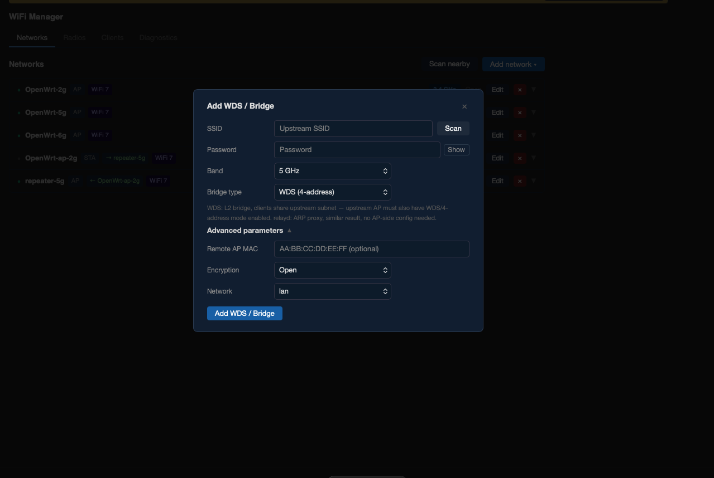

# mt7996-wifi7-manager

A LuCI-based WiFi 7 manager for the **Banana Pi BPI-R4** (MediaTek MT7988A SoC, MT7996 tri-band WiFi 7 chip).

Designed to fully leverage the capabilities of the current Linux kernel 6.12.x, MT7996 firmware, and mt76 driver — including **Multi-Link Operation (MLO)**, per-radio TX power management, and all supported client modes.

> ⚠️ **Requires OpenWrt with MediaTek SDK (MTK SDK)**
> This package is **not compatible with mainline OpenWrt**. Interface naming, MLD configuration, and hostapd parameters differ significantly between MTK SDK builds and standard OpenWrt releases. MTK SDK builds are available via the [bpi-r4-deploy](https://github.com/woziwrt/bpi-r4-deploy) repository.

---

## Hardware

| Component | Details |
|-----------|---------|
| Board | Banana Pi BPI-R4, BPI-R4 PoE |
| SoC | MediaTek MT7988A (Filogic 880) |
| WiFi chip | MT7996 tri-band (2.4 GHz / 5 GHz / 6 GHz) |
| WiFi standard | 802.11be (WiFi 7), MLO |
| RAM variants | 4 GB / 8 GB |

---

## Installation

### Included in firmware (recommended)

`luci-app-wifimgr` is included by default in all BPI-R4 firmware releases built via the [bpi-r4-deploy](https://github.com/woziwrt/bpi-r4-deploy) system — covering all hardware variants (standard, PoE, 4GB, 8GB, BE14000 board).

No additional steps needed after flashing.

### Standalone APK install

Download the latest APK from the [Releases](https://github.com/woziwrt/mt7996-wifi7-manager/releases) page and install:

```sh
# Copy APK to router
scp luci-app-wifimgr-2.0.0-r20260516.apk root@192.168.1.1:/tmp/

# Install (no internet required)
ssh root@192.168.1.1 'apk add --allow-untrusted --no-network /tmp/luci-app-wifimgr-*.apk'
```

Then open LuCI → **Network → WiFi Manager**.

---

## Screenshots

| Networks | Radios |
|----------|--------|
|  |  |

| Clients | Diagnostics |
|---------|-------------|
|  |  |

| MLO Wizard | Station Wizard | WDS / Bridge Wizard |
|------------|----------------|---------------------|
|  |  |  |

---

## Features

### Wizards — guided network setup

| Wizard | Description |
|--------|-------------|
| **MLO AP** | Creates a Multi-Link Operation AP across 2 or 3 bands. Supports 2G+5G, 2G+6G, 5G+6G, or all three simultaneously. WPA3 enforced. |
| **AP** | Creates a standard single-band AP on any radio. Full control over channel, width, encryption, SSID isolation, hidden SSID, client limits. DFS channels supported with CAC progress indication. |
| **Station** | Connects to an upstream WiFi network on 2.4G or 5G. MLO STA mode supported (multi-band client connecting to an MLO AP). |
| **WDS / Bridge** | Sets up a wireless bridge using 4-address WDS mode or L2 relayd ARP proxy. |
| **Repeater** | Creates an uplink STA connection plus a local AP on a separate radio (L3 NAT). |
| **Country** | Changes regulatory domain. Requires reboot to apply kernel regulatory database. |

### Networks tab

Live list of all configured networks with status indicators, band pills, encryption labels, and client counts. Each row expands to show full configuration. Inline edit and remove with wifi reload.

### Radios tab

Per-radio configuration (channel, bandwidth, country) and TX power management:

| Mode | Description |
|------|-------------|
| **Regulatory** | Country SKU table applied. `sku_idx=0`, no manual txpower override. |
| **eFuse max** | Driver runs at hardware eFuse maximum. Requires reboot. |
| **Manual** | Per-radio dBm cap. `sku_idx=0` + `txpower=N`. |

### Clients tab

Live client list showing signal (color-coded), WiFi generation badge (WiFi 4/5/6/7), bitrate, and per-link data for MLO clients. Disconnect button.

### Diagnostics tab

Firmware version, CPU and WiFi chip temperatures, per-radio channel utilization / noise / TX stats, MLO internals (MLD address, active links, EMLSR/STR status), and log download.

---

## Architecture

Three-layer JavaScript architecture running inside LuCI's rpcd/ubus sandbox:

```
index.js      — UI layer (plain JS, LuCI DOM helpers, no framework)
    │
layer3.js     — Wizard orchestration (high-level flows)
    │
layer2.js     — Structured data model (semantic objects)
    │
layer1.js     — Raw hardware access (UCI, ubus, iw, hostapd_cli, wpa_cli, sysfs)
```

All hardware write operations are serialized through an `hwBusy` mutex in layer1 to prevent concurrent UCI conflicts.

---

## Supported network combinations

The BPI-R4 has three radios (radio0 = 2.4 GHz, radio1 = 5 GHz, radio2 = 6 GHz) all on a single MT7996 chip. Supported combinations per router:

| Combination | Supported | Notes |
|-------------|-----------|-------|
| MLO AP (2+3 bands) | ✅ | Default setup. Requires reboot to apply. |
| MLO AP + legacy AP per radio | ✅ | Max 1 additional AP per MLO radio. Requires reboot. |
| Multiple legacy APs (no MLO) | ✅ | Standard MBSSID, wifi reload OK. |
| STA uplink on 2.4G or 5G | ✅ | Coexists with AP on same radio. |
| MLO STA (multi-band client) | ✅ | Connects to upstream MLO AP on all three bands. |
| Repeater (STA + local AP) | ✅ | STA and AP **must be on different radios**. L3 NAT. |
| WDS bridge | ✅ | 4-address mode on radio0 or radio1. |
| L2 relayd (ARP proxy) | ✅ | STA on radio0 or radio1 only. |
| STA uplink on 6G (non-MLO) | ❌ | Driver limitation — see below. |
| MLO AP + MLO STA simultaneously | ❌ | Same radios cannot be both AP-MLD and STA-MLD. |
| Repeater with same radio for STA and AP | ❌ | Blocked by wizard. |

---

## Known limitations

| Limitation | Details |
|------------|---------|
| **6G STA (non-MLO)** | Not supported. The MT7996 driver always routes band2 (6G) through the MLD code path — a standalone 6G STA scan returns no results. 6G uplink is only accessible via MLO STA mode. |
| **MLO AP + MLO STA simultaneously** | Cannot run both on the same router — they share the same three radios. The wizard blocks this with an inline error. |
| **MLO radio AP limit** | Each radio participating in an MLO group can have at most 1 additional legacy AP. Adding a second one via `wifi reload` triggers an EDCCA crash in the MT7996 driver (see below). The wizard enforces this limit and always reboots when adding an AP to an MLO radio. |
| **Per-link RSSI on secondary MLO links** | MT7996 driver reports signal only for the primary data link. Secondary links show `—`. Driver limitation, not fixable in software. |
| **6G channel utilization** | Always reported as `n/a` — driver bug: `mbssid=1` causes hostapd to report 126% utilization. Discarded in layer2. |
| **Repeater radio constraint** | The STA (uplink) and local AP must use different radios. Using the same radio for both is blocked by the wizard. |

---

## Recovery: WiFi completely dead after adding a network

If all WiFi interfaces disappear and nothing comes back after reboot or power cycle, the MT7996 MCU has likely entered a stuck state due to an EDCCA driver crash.

**Symptom:** `dmesg` shows:
```
mt7996e: Failed to start patch
mt7996e: Failed to release patch semaphore
mt7996e: probe with driver mt7996e failed with error -11
```

**Cause:** The MT7996 chip contains an internal MCU with a hardware semaphore register. An EDCCA crash (triggered by adding too many interfaces to an MLO radio via `wifi reload`) can leave this register stuck. The state survives soft reboots and short power cycles because on-board capacitors keep the chip powered for several seconds after shutdown.

**Fix:** Disconnect the router from power for **at least 15 minutes**. This fully discharges the board capacitors and resets all MCU hardware registers. WiFi will initialize normally on the next boot.

> The wizard now prevents the conditions that cause this crash. If you configure networks exclusively through WiFi Manager, you should never encounter this issue.

---

## Requirements

- OpenWrt with **MediaTek SDK (MTK SDK)** — kernel 6.12.x, MT7996 firmware, mt76 driver
- Board: Banana Pi BPI-R4 or BPI-R4 PoE (MT7988A / MT7996)
- LuCI installed

Not compatible with mainline OpenWrt due to differences in interface naming (`ap-mld-*`), MLD UCI configuration, and hostapd vendor extensions.

---

## Changelog

### v2.0.0 (2026-05-16)

**New features**

- **Channel advisor** — "Scan channels" button in each radio card. Scans nearby APs and survey noise, computes interference-weighted score, and recommends top 3 channels as color-coded buttons (green/yellow/red). Click to apply immediately.
- **Scan in wizards** — Station, WDS, and Repeater wizards now have a live scan button that lists nearby networks. Selecting one auto-fills SSID and encryption.
- **All-band nearby scan** — Diagnostics "Nearby Networks" now scans all three bands simultaneously via `uplink_scan_all()` instead of a single radio.
- **Version badge** — UI header shows current package version.

**Safety / crash protection**

- **EDCCA crash prevention in wizardAP** — Radios that are part of an MLO group and already have one legacy AP are disabled in the selector ("— at limit") and show a blocking error. Prevents a class of MT7996 driver crash that requires 15+ minutes of power-off to recover from.
- **EDCCA crash prevention in wizardMLO** — Link toggle buttons for radios already in an existing MLO group are disabled. Shows blocking error if fewer than 2 radios are available.
- **MLO radio always reboots** — wizard_ap() detects if the target radio is part of an MLO group and triggers a reboot instead of `wifi reload`, eliminating the risk of EDCCA crash even if the UI guard is bypassed.

**Bug fixes**

- Fixed misleading "DFS scan in progress" message shown on 2.4G interfaces (which have no DFS).
- Fixed TX power display in Radios tab — manual mode now shows the configured UCI value instead of the driver-reported regulatory maximum.
- Fixed scan interface selection — channel advisor and uplink scan now correctly derive the phy interface from radio_id instead of always using `phy0.0-ap0`.

---

### v1.1.1 (2026-05-14)

- Sysupgrade to OpenWrt 99211b26fb (kernel 6.12.x, MTK SDK May 2026)
- First-run UCI defaults (country=CZ, renamed default SSID)
- Hotplug TX power fix for MT7996 cold-boot TMAC=0 bug on band0/band2

### v1.0.0 (2026-05-10)

- Initial public release
- All wizards: MLO AP, legacy AP, Station (incl. MLO STA), WDS, relayd, Repeater, Country
- Networks / Radios / Clients / Diagnostics tabs
- TX power modes: Regulatory / eFuse max / Manual
- Channel utilization, noise, thermal, MLO internals in Diagnostics

---

## License

MIT
